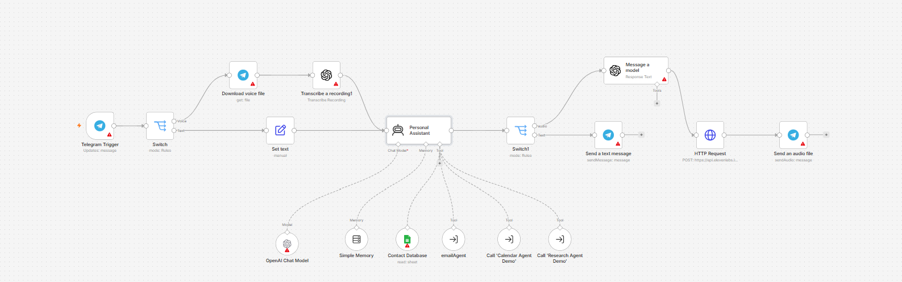
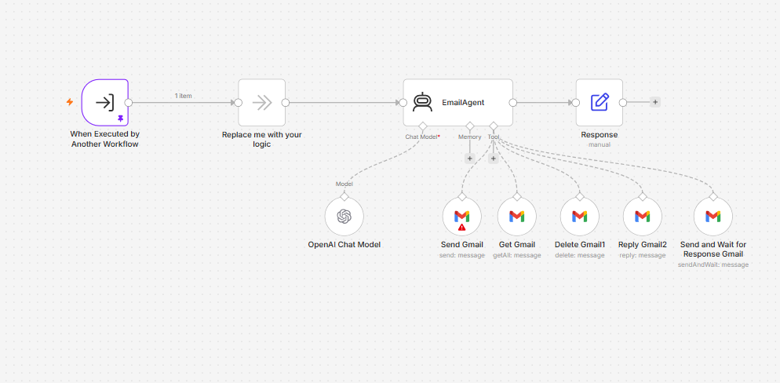
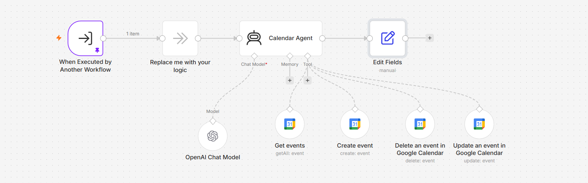
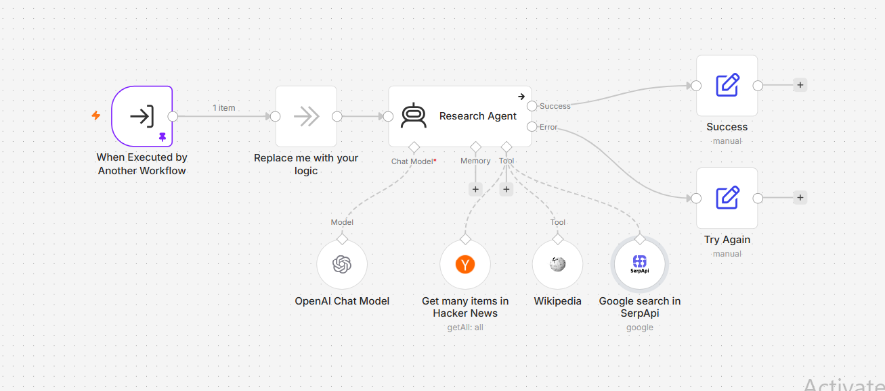

# 🤖 AI Personal Assistant — Multi-Agent n8n System

An AI-powered personal assistant built with **n8n** that understands natural-language requests and executes real-world tasks across email, calendar, contacts, web research, memory, and voice interactions.

The system is designed around a **modular AI-agent architecture**, where specialized sub-agent workflows handle domain-specific responsibilities while a central Personal Assistant coordinates incoming requests and routes tasks appropriately.

---

## 🚀 Overview

This project demonstrates an enterprise-grade AI automation system using **n8n AI Agents** and specialized sub-workflows.

The assistant can:

* 📧 Manage emails (send, read, reply, delete, send & wait for response)
* 📅 Manage calendar events (check availability, create, update, delete)
* 👤 Retrieve contact details via Google Sheets integration
* 🔎 Perform live web research using SerpApi, Wikipedia, and Hacker News
* 🧠 Maintain conversation context across turns using persistent memory
* 🎙️ Process incoming voice notes via OpenAI speech transcription
* 🔊 Deliver voice responses using ElevenLabs text-to-speech
* 🔄 Dynamically route tasks to specialized AI sub-agents

By separating core routing from execution logic, the system maintains clear boundaries, preventing context bloat and making individual capabilities easier to test, debug, and scale.

---

## 🏗️ Architecture

```text
                    ┌─────────────────────┐
                    │    Telegram User    │
                    └──────────┬──────────┘
                               │
                               ▼
                    ┌─────────────────────┐
                    │ Personal Assistant  │
                    │      AI Agent       │
                    └──────────┬──────────┘
                               │
              ┌────────────────┼────────────────┐
              │                │                │
              ▼                ▼                ▼
      ┌──────────────┐ ┌──────────────┐ ┌──────────────┐
      │ Email Agent  │ │Calendar Agent│ │Research Agent│
      └──────────────┘ └──────────────┘ └──────────────┘
              │                │                │
              ▼                ▼                ▼
          Email API        Calendar API     Web Research

                    ┌─────────────────────┐
                    │  Contact Database   │
                    └──────────┬──────────┘
                               │
                               ▼
                    ┌─────────────────────┐
                    │    Conversation     │
                    │       Memory        │
                    └─────────────────────┘
```

The system employs a **supervisor-worker orchestration pattern**.

A central Personal Assistant agent receives input from Telegram (voice or text), reads conversational context, queries local tools when appropriate, or delegates specialized domain tasks to downstream sub-agent workflows.

---

## 🤖 Personal Assistant Workflow

The Personal Assistant workflow serves as the central interface and task router for the entire multi-agent ecosystem.

It handles incoming multi-modal triggers, manages conversational state, evaluates intent, and routes tasks to connected tools or downstream sub-agents.



### Workflow Components & Execution Path

**Trigger & Input Handling**

The workflow starts with the **Telegram Trigger** node, which listens for incoming messages.

Input is passed to a **Switch** node to differentiate between voice and text.

**Voice Path**

Voice messages flow through **Download voice file** to retrieve the audio binary, followed by **Transcribe a recording1** using OpenAI Speech-to-Text to convert audio into text.

**Text Path**

Text messages bypass transcription and are structured via the **Set text** node before reaching the core agent.

### Core Intelligence & Tools

The central **Personal Assistant** agent is powered by an OpenAI Chat Model and maintains state across interaction turns using a **Simple Memory** node.

Attached directly to the agent are four specialized tools:

* **Contact Database** — Google Sheets integration for contact queries
* **emailAgent** — calls the specialized Email Agent sub-workflow
* **Call 'Calendar Agent Demo'** — calls the Calendar Agent sub-workflow
* **Call 'Research Agent Demo'** — calls the Research Agent sub-workflow

### Multi-Modal Output Routing

Once processing completes, output flows to **Switch1** to determine the user's preferred delivery format.

**Text Delivery**

Directly calls **Send a text message on Telegram**.

**Voice Synthesis Delivery**

Routes to **Message a model** to synthesize spoken responses, sends the script to ElevenLabs through an HTTP Request node, and delivers the generated voice file using **Send an audio file on Telegram**.

---

## 📧 Email Agent

The Email Agent is a dedicated sub-agent workflow designed to execute email operations received from the primary Personal Assistant.



### Workflow Components & Capabilities

**Trigger & Input Processing**

Triggered via the **When Executed by Another Workflow** node, accepting parameters passed from the main supervisor workflow.

The input passes through **Replace me with your logic** directly into the **EmailAgent** node.

### Agent Logic & Tools

The EmailAgent is driven by an OpenAI Chat Model and dynamically executes the appropriate action using five integrated Gmail tools:

* **Send Gmail** — drafting and dispatching new outbound email messages
* **Get Gmail** — searching and retrieving email threads and inbox details
* **Delete Gmail1** — removing specified email messages
* **Reply Gmail2** — sending inline responses to ongoing email conversations
* **Send and Wait for Response Gmail** — pausing workflow execution until an external recipient replies

### Output Processing

After the email action completes, results are formatted by the **Response** node and returned to the calling workflow.

---

## 📅 Calendar Agent

The Calendar Agent manages scheduling, agenda retrieval, and meeting modifications through dedicated calendar automation tools.



### Workflow Components & Capabilities

**Trigger & Logic**

Initiated by the **When Executed by Another Workflow** trigger upon receiving a scheduling command from the supervisor agent.

Input routes through **Replace me with your logic** to the core **Calendar Agent** node.

### Agent Logic & Tools

Driven by an OpenAI Chat Model, the agent evaluates scheduling requests and selects among four Google Calendar tools:

* **Get events** — fetching existing appointments to check availability and agenda details
* **Create event** — booking new meetings and calendar events
* **Delete an event in Google Calendar** — removing cancelled meetings
* **Update an event in Google Calendar** — modifying or rescheduling existing appointments

### Output Formatting

Results pass through an **Edit Fields** node to ensure clean, structured JSON parameters are returned to the parent workflow.

---

## 🔎 Research Agent

The Research Agent is a specialized sub-agent workflow built for real-time web research, technology news collection, and factual knowledge retrieval.



### Workflow Components & Capabilities

**Trigger & Logic**

Invoked by **When Executed by Another Workflow** when the main assistant requires external data.

Inputs flow through **Replace me with your logic** to the **Research Agent** node.

### Agent Logic & Tools

The Research Agent utilizes an OpenAI Chat Model to decompose research queries and query three distinct data tools:

* **Get many items in Hacker News** — retrieving tech news, developer trends, and community discussions
* **Wikipedia** — performing factual lookups and encyclopedic reference checks
* **Google search in SerpApi** — performing live Google web searches for up-to-date online information

### Execution Routing

The agent features status-driven output paths, explicitly routing execution through **Success** or **Try Again** manual nodes to handle error recovery and ensure reliable research responses.

---

## 👤 Contact Database

Contact discovery is built directly into the main Personal Assistant workflow through the **Contact Database** tool node.

### Integration

Connects to a Google Sheets document serving as a lightweight CRM.

### Functionality

Reads contact information such as email addresses or phone numbers when requested by the user or when needed by the EmailAgent or CalendarAgent.

### Safety

Prevents the LLM from hallucinating recipient contact details by forcing a mandatory lookup before executing communication tasks.

---

## 🎙️ Voice Automation

The system supports end-to-end multi-modal voice processing through Telegram.

### Input Voice Pipeline

1. User sends a Telegram voice note.
2. Telegram Trigger catches the update.
3. Switch routes the message through the Voice path.
4. Download voice file fetches the raw audio binary.
5. Transcribe a recording1 sends the audio to OpenAI Whisper API.
6. The transcribed text is passed directly into the Personal Assistant agent.

### Output Voice Pipeline

1. Personal Assistant generates a textual resolution.
2. Output routes through Switch1.
3. Message a model formats the text for conversational speech.
4. HTTP Request calls the ElevenLabs API to generate voice audio.
5. Send an audio file delivers the spoken response back to the user on Telegram.

---

## 🧠 AI Agent Architecture

The modular design relies on strict task delegation rather than a monolithic prompt.

```text
User Request (Telegram)
         │
         ▼
Personal Assistant (Central Router)
         │
         ├─── Query Contacts? ──► Contact Database (Google Sheets)
         │
         ├─── Manage Email? ────► Email Agent Sub-Workflow
         │                            ├── Send / Get / Delete / Reply
         │                            └── Send & Wait for Response
         │
         ├─── Manage Calendar? ──► Calendar Agent Sub-Workflow
         │                            ├── Get / Create Events
         │                            └── Delete / Update Events
         │
         └─── Live Research? ───► Research Agent Sub-Workflow
                                      ├── Google Search (SerpApi)
                                      ├── Wikipedia
                                      └── Hacker News
```

---

## 🛡️ Reliability & Safety

The system enforces operational guardrails to maintain execution accuracy.

* **No Information Invention:** Agents are configured to state missing data rather than hallucinate facts.
* **Deterministic Tool Calls:** Email addresses and event details must be confirmed via database or tool outputs prior to execution.
* **Explicit Execution Routing:** Sub-workflows include fallback paths (Success / Try Again) to manage API rate limits or missing results gracefully.
* **State Isolation:** Sub-agents operate with distinct execution contexts, keeping sub-task tool outputs isolated from main memory.

---

## 🛠️ Technology Stack

| Category       | Technology / Service              | Usage in Project                                               |
| -------------- | --------------------------------- | -------------------------------------------------------------- |
| Orchestration  | n8n                               | Workflow orchestration, AI Agent nodes, tool binding           |
| LLM Engine     | OpenAI                            | Language logic and AI reasoning                                |
| Interface      | Telegram Bot API                  | User communication (Text & Voice)                              |
| Voice AI       | OpenAI Whisper / ElevenLabs       | Speech-to-Text and Text-to-Speech                              |
| Database       | Google Sheets API                 | Contact information storage and retrieval                      |
| Email          | Gmail API                         | Reading, sending, replying, and managing email threads         |
| Calendar       | Google Calendar API               | Fetching availability, creating, updating, and deleting events |
| Research Tools | SerpApi / Wikipedia / Hacker News | Real-time web search and knowledge retrieval                   |

---

## 📁 Repository Structure

```text
ai-personal-assistant-n8n/
├── screenshots/
│   ├── personal-assistant.png
│   ├── email-agent.png
│   ├── calendar-agent.png
│   └── research-agent.png
├── personal-assistant.json
├── email-agent.json
├── calendar-agent.json
├── research-agent.json
└── README.md
```

---

## ⚙️ Setup

### 1. Import Workflows

Import all four JSON files into your n8n instance:

* `email-agent.json`
* `calendar-agent.json`
* `research-agent.json`
* `personal-assistant.json`

### 2. Configure Credentials

Set up the required API credentials within n8n:

* Telegram API — Telegram Trigger & Send nodes
* OpenAI API — Chat Models & Audio Transcription
* Google OAuth2 / Service Account — Gmail, Google Calendar, Google Sheets
* ElevenLabs API — HTTP Request node for TTS
* SerpApi Key — Google Search tool

### 3. Update Sub-Workflow References

In `personal-assistant.json`, open the tool nodes for:

* `emailAgent`
* `Call 'Calendar Agent Demo'`
* `Call 'Research Agent Demo'`

Then select the imported workflow IDs corresponding to your n8n instance.

### 4. Activate Workflows

Toggle all four workflows to **Active**.

Connect your Telegram bot and start sending text or voice commands.

---

## 🔐 Security

### Credential Storage

All API keys, tokens, and OAuth secrets must be managed strictly using n8n's internal encrypted credential store.

### No Secret Exposure

Never commit workflow files containing exposed credentials or private keys to public repositories.

---

## 💡 Example Requests

```text
"Find Ahmed's email address in my contacts."

"Send an email to Ahmed letting him know the project files are ready."

"Check my calendar for tomorrow afternoon and schedule a meeting with Ahmed at 3 PM."

"Research the latest developments in AI agents and give me a summary."

"Send me a voice message with my schedule for today."
```

---

## 🎯 Project Goals

This project demonstrates practical competence in:

* Architectural separation of multi-agent AI systems in n8n
* Multi-modal inputs and outputs (Voice STT/TTS & Text)
* Dynamic tool routing and agent task delegation
* Production API integrations across communication, scheduling, and search services
* Building reliable, guardrailed AI workflows for real-world applications

---

## 📌 Future Improvements

* Integration with WhatsApp and Slack channels
* Support for Microsoft Outlook and Teams APIs
* Long-term vector database memory for personal preferences
* Human-in-the-loop approval steps for destructive actions such as deleting emails or calendar events
  
## 🎥 Demo

🎬 **Full End-to-End Demo**

[▶️ Watch the AI Personal Assistant Demo](https://drive.google.com/file/d/1tjMiGuLNnU2VFwJOWxfRM6qwvy8ezT-h/view?usp=sharing)

The demo shows the assistant handling voice and text requests, calendar scheduling, contact lookup, email operations, web research, and multi-agent task orchestration.
---

## 👨‍💻 Author

**Ahmed Gabr Elzanbeel**

AI Automation & Integration Engineer | AI Agents | n8n | APIs | Workflow Automation

